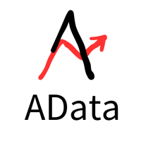

# [AData](https://adata.30006124.xyz)

<p align="center">
  <a href="https://adata.30006124.xyz/" target="_blank">
    
  </a>
</p>

[](https://pypi.org/project/adata/)[](https://gitee.com/inchaos/adata/blob/main/LICENSE)[](https://pepy.tech/project/adata)[](https://pepy.tech/project/adata)


## 0、[介绍](https://adata.30006124.xyz/idea.html)
> 专注A股，专注量化，向阳而生；开放、纯净、持续、为Ai(爱)发电。
>
> 专注股票行情数据，为了保证数据的高可用性，采用多数据源融合切换。
>
> 目标：支持个人量化行情的需要；众人拾柴火焰高，欢迎加入。

**市场寒冷，发热不易，坚持更难；如有帮助到你，右上角点 ⭐Star 一键三连，谢谢支持和收藏^_^**

## 一、[快速开始](https://adata.30006124.xyz/quickStart.html)

### （1）安装sdk

~~~python
# 首次安装
pip install adata
# 指定镜像源
pip install adata -i http://mirrors.aliyun.com/pypi/simple/

# 升级版本
pip install -U adata
# 指定镜像源
pip install -U adata -i http://mirrors.aliyun.com/pypi/simple/
~~~

**注：国内镜像可能存在同步延迟，可使用官方镜像源，以下是镜像源**

阿里云【推荐】：http://mirrors.aliyun.com/pypi/simple/  

清华大学：https://pypi.tuna.tsinghua.edu.cn/simple  

官方镜像源：https://pypi.org/simple

### （2）使用示例

#### 1. 获取股票代码

获取所有的股票代码

~~~python
import adata

res_df = adata.stock.info.all_code()
print(res_df)
~~~

示例结果：

~~~python
  stock_code short_name exchange
0        001324       N长青科       SZ
1        301361       众智科技       SZ
2        300514        友讯达       SZ
...         ...        ...      ...
5490     300367        网力退       SZ
5491     300372        欣泰退       SZ
5492     300431        暴风退       SZ

[5493 rows x 3 columns]
~~~

#### 2. 获取股票的行情

获取到股票代码后，传入对应的stock_code参数，查询对应股票的行情信息。

```python
import adata

# k_type: k线类型：1.日；2.周；3.月 默认：1 日k
res_df = adata.stock.market.get_market(stock_code='000001', k_type=1, start_date='2021-01-01')
print(res_df)
```

示例结果：

~~~python
            trade_time   open  close  ... pre_close stock_code  trade_date
0    2021-01-04 00:00:00  18.69  18.19  ...     18.93     000001  2021-01-04
1    2021-01-05 00:00:00  17.99  17.76  ...     18.19     000001  2021-01-05
2    2021-01-06 00:00:00  17.67  19.15  ...     17.76     000001  2021-01-06
..                   ...    ...    ...  ...       ...        ...         ...
573  2023-05-18 00:00:00  12.57  12.49  ...     12.49     000001  2023-05-18
574  2023-05-19 00:00:00  12.43  12.34  ...     12.49     000001  2023-05-19
575  2023-05-22 00:00:00  12.31  12.38  ...     12.34     000001  2023-05-22

[576 rows :x 13 columns]
~~~

#### 3. 其它数据使用

请参考下面数据列表和相关字典文档，找到对应的函数并查看对应的函数注释，进行正确使用。

- [数据字典](https://adata.30006124.xyz/dic/stockInfo.html) 

####  4. 代理设置

项目是基于公开接口，可能存在限制等，因此增加代理设置功能

~~~
import adata

# 设置代理,代理是全局设置,代理失效后可重新设置。参数:ip,proxy_url
adata.proxy(is_proxy=True, ip='60.167.21.27:1133')
res_df = adata.stock.info.all_code()
print(res_df)
~~~

**注：**

- proxy_url: 获取代理Ip的链接；ip和proxy_url方式选择其一；
- 每次请求获取一次，为节省ip资源建议使用自建的代理池。

## 二、[数据列表](https://adata.30006124.xyz/dic/dataList.html)

整理了最新版本的数据列表和相关使用Api，详细内容和相关使用参数，请参考数据字典文档。

- [数据列表](https://adata.30006124.xyz/dic/dataList.html) 
- [数据字典](https://adata.30006124.xyz/dic/stockInfo.html)

### （1）股票-Stock

#### 	1. 基本信息

| 数据             | API                                   | 说明                                   | 备注                                                         |
| ---------------- | ------------------------------------- | -------------------------------------- | ------------------------------------------------------------ |
| A股代码          | stock.info.all_code()                 | 所有A股代码信息                        |                                                              |
| 股本信息         | stock.info.get_stock_shares()         | 获取单只股票的股本信息                 | 来源：东方财富                                               |
| 申万一二级行业   | stock.info.get_industry_sw()          | 获取单只股票的申万一二级行业           | 来源：百度                                                   |
| **概念**         |                                       |                                        |                                                              |
| 来源：同花顺     |                                       |                                        |                                                              |
| 概念代码         | stock.info.all_concept_code_ths()     | 所有A股概念代码信息（同花顺）          | 来源：同花顺公开数据                                         |
| 概念成分列表     | stock.info.concept_constituent_ths()  | 获取同花顺概念指数的成分股（同花顺）   | 注意：返回结果只有股票代码和股票简称，可根据概念名称查询     |
| 股票所属概念     | stock.info.get_concept_ths()          | 获取单只股票所属的概念板块             | [F10](https://basic.10jqka.com.cn/300033/concept.html)       |
| 来源：东方财富   |                                       |                                        |                                                              |
| 概念代码         | stock.info.all_concept_code_east()    | 所有A股概念代码信息（东方财富）        | 来源：[东方财富](https://data.eastmoney.com/bkzj/gn.html)    |
| 概念成分列表     | stock.info.concept_constituent_east() | 获取同花顺概念指数的成分股（东方财富） | 注意：返回结果只有股票代码和股票简称，可根据概念名称查询     |
| 股票所属概念     | stock.info.get_concept_east()         | 获取单只股票所属的概念板块             | [核心题材](https://emweb.securities.eastmoney.com/pc_hsf10/pages/index.html?type=web&code=SZ300059&color=b#/hxtc) |
| 股票所属板块     | stock.info.get_plate_east()           | 获取单只股票所属的板块                 | 1. 行业 2. 地域板块 3.概念，综合的概念接口                   |
| **指数**         |                                       |                                        |                                                              |
| 指数代码         | stock.info.all_index_code()           | 获取所有A股市场的指数代码              | 来源同花顺，可能存在同花顺对代码重新编码的情况               |
| 指数对应的成分股 | stock.info.index_constituent()        | 获取对应指数的成分股列表               |                                                              |
| **其它**         |                                       |                                        |                                                              |
| 股票交易日历     | stock.info.trade_calendar()           | 获取股票交易日信息                     | 来源：深交所                                                 |

#### 	2. 行情信息


| 数据                | API                                            | 说明                                  | 备注                                                         |
| ------------------- | ---------------------------------------------- | ------------------------------------- | ------------------------------------------------------------ |
| 分红信息            | stock.market.get_dividend()                    | 获取单只股票的分红信息                |                                                              |
| 股票行情            | stock.market.get_market()                      | 获取单只股票的行情信息-日、周、月 k线 |                                                              |
|                     | stock.market.get_market_min()                  | 获取单个股票的今日分时行情            | 只能获取当天                                                 |
| <u>**实时行情**</u> | stock.market.list_market_current()             | 获取多个股票最新行情信息              | 实时行情<br />数据源：2个，新浪和腾讯                        |
|                     | stock.market.get_market_five()                 | 获取单个股票的5档行情信息             | 实时行情<br />数据源：2个，腾讯和百度                        |
|                     | stock.market.get_market_bar()                  | 获取单个股票的分笔成交行情            | 实时行情<br />[股市通](https://gushitong.baidu.com/stock/ab-872925) |
| 概念行情-同花顺     | stock.market.get_market_concept_ths()          | 获取单个概念的行情信息-日、周、月 k线 | 获取同花顺概念行情时，<br />请注意传入参数是指数代码还是概念代码，<br />指数代码8开头，index_code |
|                     | stock.market.get_market_concept_min_ths()      | 获取同花顺概念行情-当日分时           | 只能获取当天                                                 |
|                     | stock.market.get_market_concept_current_ths()  | 获取同花顺当前的概念行情              | 实时行情                                                     |
| 概念行情-东方财富   | stock.market.get_market_concept_east()         | 获取单个概念的行情信息-日、周、月 k线 | 获取东方财富概念行情时，<br />指数代码BK开头，index_code     |
|                     | stock.market.get_market_concept_min_east()     | 获取同花顺概念行情-当日分时           | 只能获取当天                                                 |
|                     | stock.market.get_market_concept_current_east() | 获取同花顺当前的概念行情              | 实时行情                                                     |
| 指数行情            | stock.market.get_market_index()                | 获取指数的行情信息-日、周、月 k线     |                                                              |
|                     | stock.market.get_market_index_min()            | 获取指数的行情-当日分时               |                                                              |
|                     | stock.market.get_market_index_current()        | 获取当前的指数行情                    | 实时行情                                                     |
| 个股资金流          | stock.market.get_capital_flow_min()            | 获取单个股票的今日分时资金流向        | 最新实时数据                                                 |
|                     | stock.market.get_capital_flow()                | 获取单个股票的资金流向                | 历史日度数据                                                 |
| 概念资金流          | stock.market.all_capital_flow_east()           | 获取所有东财概念近N日资金流向         | 获取近1,5,10日资金流向<br />数据源：[东方财富](https://data.eastmoney.com/bkzj/gn.html) |

**注：概念和指数从本质来看是一样的，所以相关的接口和返回结果是一致的，概念是各个厂商自定义的指数，指数是官方或者权威机构定义的，都是一揽子股票的组合。**

#### 3.  财务数据

| 数据         | API                            | 说明                       | 备注                                             |
| ------------ | ------------------------------ | -------------------------- | ------------------------------------------------ |
| 核心财务数据 | stock.finance.get_core_index() | 获取单只股票的核心财务数据 | 来源：东方财富<br />三大报表详细数据，暂时不提供 |

### （2）基金-ETF

#### 1. 基本信息

| 数据        | API                                      | 说明                     | 备注                                                         |
| ----------- | ---------------------------------------- | ------------------------ | ------------------------------------------------------------ |
| ETF（场内） | fund.info.all_etf_exchange_traded_info() | 获取所有A股市场的ETF信息 | 来源：1. [东方财富](http://quote.eastmoney.com/center/gridlist.html#fund_etf) |

#### 2. 行情信息

| 数据    | API                                  | 说明                             | 备注                                     |
| ------- | ------------------------------------ | -------------------------------- | ---------------------------------------- |
| ETF行情 | fund.market.get_market_etf()         | 获取ETF的行情信息-日、周、月 k线 | 来源：[同花顺](https://m.10jqka.com.cn/) |
|         | fund.market.get_market_etf_min()     | 获取ETF的行情-当日分时           |                                          |
|         | fund.market.get_market_etf_current() | 获取当前的ETF行情                | 实时行情                                 |

### （3）债券-Bond

| 数据       | API                               | 说明                                | 备注                                                   |
| ---------- | --------------------------------- | ----------------------------------- | ------------------------------------------------------ |
| 可转债代码 | bond.info.all_convert_code()      | 获取所有A股市场的可转换债券代码信息 | 来源：1. [同花顺](http://data.10jqka.com.cn/ipo/bond/) |
| 可转债行情 | bond.market.list_market_current() | 获取A股市场的可转换债券最新行情     | 来源：新浪                                             |

### （4）舆情

| 数据                     | API                                  | 说明                                       | 备注                                                         |
| ------------------------ | ------------------------------------ | ------------------------------------------ | ------------------------------------------------------------ |
| 最近一个月的股票解禁列表 | sentiment.stock_lifting_last_month() | 查询最近一个月的股票解禁列表               | 来源：1. [同花顺](http://data.10jqka.com.cn/market/xsjj/)    |
| 全市场融资融券余额列表   | sentiment.securities_margin()        | 查询全市场融资融券余额列表                 | 来源：1. [东方财富](https://data.eastmoney.com/rzrq/)        |
| **北向资金-行情**        |                                      |                                            |                                                              |
|                          | sentiment.north.north_flow_current() | 获取北向资金（沪深港通）当前流入资金的行情 | 来源：1.[东方财富](https://data.eastmoney.com/hsgt/index.html) |
|                          | sentiment.north.north_flow_min()     | 获取北向资金分时行情                       |                                                              |
|                          | sentiment.north.north_flow()         | 获取北向资金历史流入行情                   |                                                              |
| **热度榜单**             | sentiment.hot.pop_rank_100_east      | 东方财富人气100榜单                        | 来源：[东方财富](http://guba.eastmoney.com/rank/)            |
|                          | sentiment.hot.hot_rank_100_ths()     | 同花顺热度100排行榜                        | 来源：[同花顺](https://dq.10jqka.com.cn/fuyao/hot_list_data/out/hot_list/v1/stock?stock_type=a&type=hour&list_type=normal) |
|                          | sentiment.hot.hot_concept_20_ths()   | 同花顺热门概念板块20排行榜                 | 来源：[同花顺](https://dq.10jqka.com.cn/fuyao/hot_list_data/out/hot_list/v1/stock?stock_type=a&type=hour&list_type=normal) |
|                          | sentiment.hot.list_a_list_daily()    | 龙虎榜单列表                               | 来源：[东方财富](https://data.eastmoney.com/stock/lhb/yyb/10033779.html) |
|                          | sentiment.get_a_list_info()          | 单只股票龙虎榜信息详情                     | 来源：[东方财富](https://data.eastmoney.com/stock/lhb/yyb/10033779.html) |
| **扫雷**                 | sentiment.mine.mine_clearance_tdx()  | 单只股票的扫雷避险信息                     | 来源：通达信                                                 |
| 其它数据排期中           | TODO                                 | 若您有相关资源可以一起参与贡献             |                                                              |

## 三、[数据源](https://adata.30006124.xyz/dataSource.html)

| 数据源     | 板块                                                         | 描述             |
| ---------- | ------------------------------------------------------------ | ---------------- |
| 同花顺     | [数据中心](http://data.10jqka.com.cn/)，[行情中心](http://q.10jqka.com.cn/)，[问财](http://www.iwencai.com/unifiedwap/home/index) | 让投资变的更简单 |
| 百度股市通 | [股市通](https://gushitong.baidu.com/)                       | 科技让投资更简单 |
| 东方财富   | [数据中心](https://data.eastmoney.com/center/)，[行情中心](http://quote.eastmoney.com/center/) | 财经门户         |
| 腾讯理财   | [行情中心](https://stockapp.finance.qq.com/mstats/#)         |                  |
| 新浪财经   | [新浪财经](https://finance.sina.com.cn/stock/)               | 门户网站         |

***--------------------------------------------感谢各位大厂提供的数据----------------------------------------------***

## 四、 其它参考

主要记录查阅过的项目和相关平台，并对此项目产生了深远印象，特此鸣谢。

| [akshare](https://gitee.com/mirrors/akshare) | [聚宽量化](https://www.joinquant.com/) | [baostock](http://baostock.com/baostock/index.php/Python%E5%BC%80%E5%8F%91%E8%B5%84%E6%BA%90) | [MyData](http://api.mairui.club/hsdata.html) |
| -------------------------------------------- | -------------------------------------- | ------------------------------------------------------------ | -------------------------------------------- |

## 五、发布计划

|      | 版本号 | 内容 | 发布日期     | 备注                           |
| ---- | ------ | ---- | ------------ | ------------------------------ |
| ✅    | 0.x.x  | 股票 | 2023-04-05 ~ | 预览版本                       |
| ✅ ️    | 1.x.x  | 股票 | 2023-10-01   | 中国Ai股                       |
| ☑️    | 2.x.x  | 基金、债券 | 开发中 | 场内可交易基金：ETF、可转债        |
| ☑️    | 3.x.x | xxx        | 排期中       |  |

## 六、理念

1. 关于AData，我们只关注交易产生的数据。在A股只有交易数据是真实的，对于量化和AI训练，也只需要关心交易相关的行情数据，做到真正的专注。当然，你可能会说财务数据等也非常有用，但财务数据相对滞后，而且可能ZJ，甚至有XL可能，最终对于普通交易者可能就成了接盘侠。财务数据在我们这里，只做股票池筛选作用，不做实时交易指标推荐。

2. 根据多年的数据治理经验，函数和字典在设计上面，符合标准的数据存储，可根据数据字典建表落地到数据库。

3. 距离15年已过8年，时光匆匆，**抓住底部机会**。

**注：**

- 永久免费开源A股数据库，只有交易相关的数据，专注量化交易。
- 送给A股的各位朋友一首歌：[谢天笑-向阳花](https://adata.30006124.xyz/向阳花.html)，愿你我向阳而生。

## 参与贡献

1.  Fork 本仓库
2.  新建 Feat_xxx 分支
3.  提交代码（注意代码风格和本项目一致即可）
4.  新建 Pull Request


## 特别鸣谢

> 对于项目有支持，包括但不仅限：内容贡献，bug提交，思想交流等等，对项目有影响的个人和机构

| Simon                                     | [bigbigbigfish](https://github.com/bigbigbigfish) | [LuneZ99](https://github.com/LuneZ99)         | 匿名用户 | thue                                    | [Triones009](https://github.com/Triones009) |
| ----------------------------------------- | ------------------------------------------------- | --------------------------------------------- | -------- | --------------------------------------- | ------------------------------------------- |
| [yxm0513](https://github.com/yxm0513)     | [hanxuanliang](https://github.com/hanxuanliang)   | [akihara-sam](https://github.com/akihara-sam) | Andy     | [baei2048](https://github.com/baei2048) | [zpsakura](https://github.com/zpsakura)     |
| [Lorry1123](https://github.com/Lorry1123) | 多维人格                                          | xmoney                                        |          |                                         |                                             |

----------------------------------------------------------------------

> 
## Star History

[](https://star-history.com/#1nchaos/adata&Date)

## 欢迎进行交流
<p align="center">
  <a href="https://adata.30006124.xyz/wx.html" target="_blank">
    
  </a>
  <a href="https://mp.weixin.qq.com/s/ZQMXgxIYKtfjiPQK-p-aXg" target="_blank">
    
  </a>
</p>

- 添加wx好友，备注：Adata量化进交流群；
- 扫码关注向阳花策略，不定期分享量化的知识，一起实盘量化切磋；
- 创始交流群和公众号都是近期建立，意在提供一个交流的平台，欢迎讨论交流；
- 一起保卫3000点直到突破6124点。

